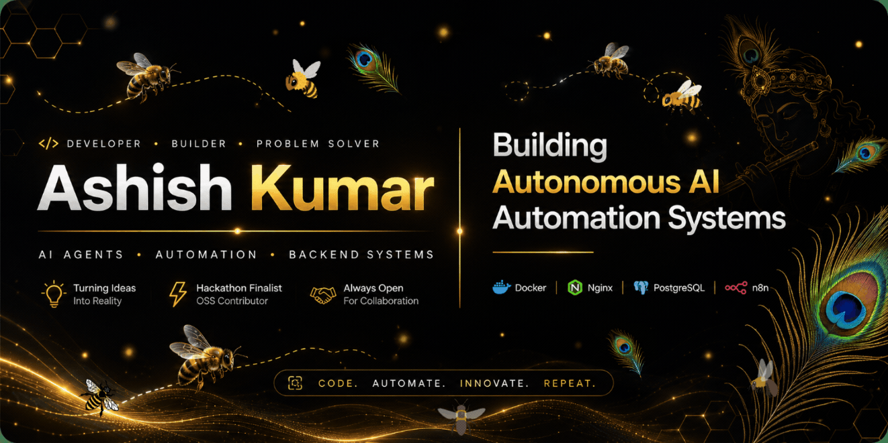

<div align="center">



</div>

<!-- Animated Typing Header -->
<div align="center">

</div>

<br/>

<!-- Status Badges Row -->
<div align="center">

[](https://micro1.ai)&nbsp;
[](https://github.com/Ashishkumar1854)&nbsp;
[](https://github.com/Ashishkumar1854)&nbsp;
[](https://github.com/Ashishkumar1854)

</div>

<br/>

---

## 🧑‍💻 About Me

```yaml
🧑 Name        : Ashish Kumar
💼 Role        : Full Stack SaaS & AI Engineer
🏢 Experience  : Product Engineer @ Phoneo | Founder @ College Incubation
🎓 Education   : B.Tech IT — Rungta College of Engineering (2022–2026)
📍 Location    : Bhilai, Chhattisgarh, India 🇮🇳
🌐 Portfolio   : https://ashishportfolio.aigateway.in
💡 Focus       : Multi-Tenant SaaS · AI Agents · RAG · REST APIs
🎯 Stats       : 150+ LeetCode/GFG Problems · 90% Acceptance Rate
```

---

## 🚀 Featured Projects

<table>
<tr>
<td width="50%" valign="top">

### 🛠️ KarigarHQ — Repair ERP SaaS
**Multi-Tenant SaaS · 4-Tier RBAC · 9-Stage Lifecycle**

> Repair business ERP with branch-level data isolation, automated workflows, and containerized deployment.

- 👤 4-Role tier: Super Admin → Owner → Admin → Tech
- ⚙️ Full 9-stage job lifecycle automation
- 🐳 Docker + GitHub Actions CI/CD on AWS EC2
- 📉 Deploy time: **45 min → <5 min**
- ✅ 20 backend integration tests


</td>
<td width="50%" valign="top">

### 🤖 AiGateway — Multi-Tenant AI SaaS
**Turborepo Monorepo · LLM Agents · n8n Automation**

> AI-powered lead research platform with autonomous scoring agents and human-in-the-loop validation.

- 🏗️ Turborepo: 3 Next.js apps + Python FastAPI microservices
- 🧠 n8n + OpenAI/Gemini lead scoring agent (0–100)
- 🔒 Human-in-the-loop gate before CRM insertion
- 🗄️ Tenant-aware MongoDB + PostgreSQL schema isolation


</td>
</tr>
<tr>
<td width="50%" valign="top">

### 🗳️ Secure Biometric Voting System
**OpenCV Face Recognition · 97% Accuracy · ACID-Compliant**

> Tamper-proof digital voting with computer vision authentication to eliminate proxy voting.

- 👁️ OpenCV + FastAPI face recognition — **97% accuracy**
- 🔐 ACID-compliant session state + encrypted audit trail
- 🚫 Zero proxy voting in live authentication flow

[](https://www.linkedin.com/posts/ashishkumar1854_electioncommissionofindia-blockchainvoting-activity-7346224352129875970-zjVA)


</td>
<td width="50%" valign="top">

### 📱 Phoneo — SaaS Marketing Platform
**B2B SaaS · 4,300+ Shops · 100 Cities**

> High-converting seller acquisition platform for mobile retail stores with lead capture & funnel optimization.

- 🏪 Serving **4,300+ mobile stores** across 100 cities
- 📈 Lead capture & demo booking funnels — **60% friction reduction**
- 🔧 Fixed critical production bugs in **<2 hours**, zero downtime


</td>
</tr>
</table>

---

## 🛠️ Tech Stack

### ⚡ Languages


### 🖥️ Frontend


### ⚙️ Backend & APIs


### 🗄️ Databases & ORM


### 🤖 AI / ML & Automation


### 🐳 DevOps & Infrastructure


---

## 🏆 Achievements & Certifications

<table>
<tr>
<td>🥇</td>
<td><strong>National Finalist — NCIIPC-AICTE Pentathon 2025</strong></td>
<td>Top <strong>230 / 26,000 teams</strong> • India's Premier Cybersecurity Hackathon</td>
</tr>
<tr>
<td>🏆</td>
<td><strong>National Finalist — CIH 2.0 National Hackathon 2025</strong></td>
<td>Recognized for breakthrough tech innovation at the national stage</td>
</tr>
<tr>
<td>🛡️</td>
<td><strong>Micro1 Certified Developer</strong></td>
<td>AI-driven rigorous technical vetting on global talent platform</td>
</tr>
<tr>
<td>📊</td>
<td><strong>AMCAT — Top 15 Percentile</strong></td>
<td>Excelled in quantitative, logical & domain assessments</td>
</tr>
<tr>
<td>🌐</td>
<td><strong>OSS Contributor</strong></td>
<td><a href="https://github.com/wtasg/meetonline/pull/316">PR #316 Merged</a> @ wtasg/meetonline — Favicon, branding & HTML optimization</td>
</tr>
</table>

---

## 📊 GitHub Stats & Analytics

<p align="center">

[](https://github.com/Ashishkumar1854)

</p>

<p align="center">

[](https://github.com/Ashishkumar1854)
[](https://github.com/Ashishkumar1854)

</p>

<p align="center">

[](https://git.io/streak-stats)

</p>

<p align="center">

[](https://github.com/ashutosh00710/github-readme-activity-graph)

</p>

---

## 🤝 Let's Connect

<div align="center">

[](https://linkedin.com/in/ashishkumar1854)
[](https://ashishportfolio.aigateway.in)
[](mailto:ashishyadav.dev@gmail.com)
[](https://leetcode.com/Ashishkumar1854)
[](https://hackerrank.com/Ashishkumar)
[](https://geeksforgeeks.org/user/ashishkumar1854)

</div>

<br/>

<p align="center">


</p>
