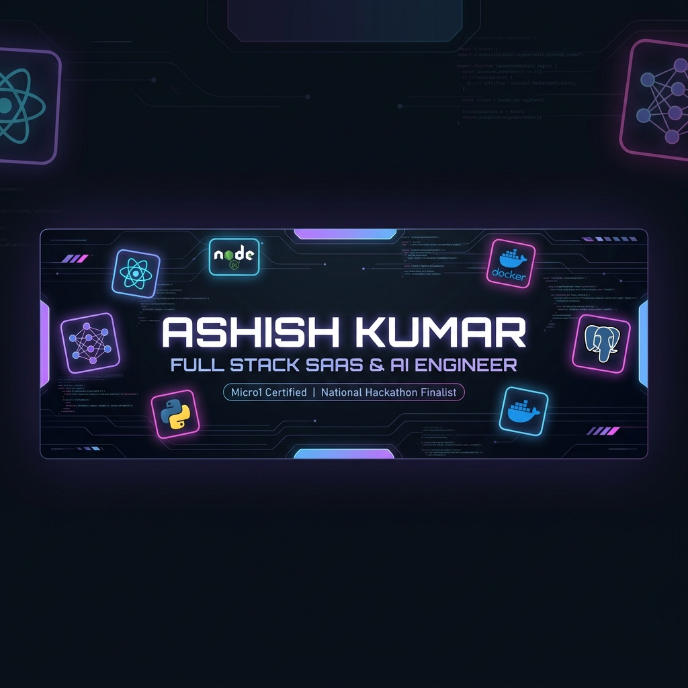

<p align="center">
  
</p>

<p align="center">
  <a href="https://git.io/typing-svg">
    
  </a>
</p>

<p align="center">
  
  
  
  
  
</p>

---

```json
{
  "developer": {
    "name": "Ashish Kumar",
    "role": "Full Stack SaaS & AI Engineer",
    "experience": "Product Engineer @ Phoneo | Founder @ College Incubation",
    "location": "Chhattisgarh, India 🇮🇳 (Open for Remote / On-site)",
    "education": "B.Tech in Information Technology @ Rungta College (2022 - 2026)",
    "passions": ["Multi-Tenant SaaS Architecture", "Autonomous AI Agents & RAG", "High-Performance REST APIs"],
    "code_stats": "150+ LeetCode/GFG Problems | 90% Acceptance Rate"
  }
}
```

---

## 🚀 Featured SaaS & AI Products

<table border="0">
  <tr>
    <td width="50%" valign="top">
      <h3>🛠️ KarigarHQ — Repair ERP SaaS</h3>
      <p><i>Multi-Tenant Repair ERP SaaS with 4-Tier RBAC & 9-Stage Lifecycle Automation</i></p>
      <ul>
        <li>Architected 4-role tier hierarchy (Super Admin, Owner, Admin, Tech) with branch-level data isolation.</li>
        <li>Automated full 9-stage lifecycle (Customer Intake ➔ Diagnosis ➔ Billing ➔ Handover).</li>
        <li>Cut deployment time from <b>45 to &lt;5 mins</b> using Docker containerization & GitHub Actions CI/CD on AWS EC2.</li>
        <li>Validated reliability with 20 backend integration tests for RBAC & tenant isolation.</li>
      </ul>
      <p>
        
        
        
        
        
      </p>
    </td>
    <td width="50%" valign="top">
      <h3>🤖 AiGateway — Multi-Tenant AI SaaS</h3>
      <p><i>Turborepo Monorepo Platform powering Autonomous AI Lead Research Agents</i></p>
      <ul>
        <li>Engineered Turborepo setup uniting 3 Next.js apps with Python FastAPI AI microservices.</li>
        <li>Deployed Lead Research Agent powered by <b>n8n + LLMs (OpenAI/Gemini)</b> scoring leads (0-100).</li>
        <li>Implemented human-in-the-loop validation gate prior to CRM lead insertion.</li>
        <li>Engineered tenant-aware security and schema separation across MongoDB & Postgres.</li>
      </ul>
      <p>
        
        
        
        
        
      </p>
    </td>
  </tr>
  <tr>
    <td width="50%" valign="top">
      <h3>🗳️ Secure Digital Voting Platform</h3>
      <p><i>Tamper-Proof Voting with Biometric Computer Vision Authentication</i></p>
      <ul>
        <li>Delivered ACID-compliant session state and encrypted audit trail for strict 1-person-1-vote integrity.</li>
        <li>Integrated face recognition via <b>OpenCV + Python FastAPI</b> hitting <b>97% detection accuracy</b>.</li>
        <li>Eliminated proxy voting during live authentication flow.</li>
      </ul>
      <p>
        
        
        
        
      </p>
    </td>
    <td width="50%" valign="top">
      <h3>📱 Phoneo SaaS — Public Platform</h3>
      <p><i>High-converting SaaS Web Application serving 4,300+ shops across 100 cities</i></p>
      <ul>
        <li>Launched seller marketing platform driving acquisition across 4,300 mobile retail stores.</li>
        <li>Built lead capture, demo booking funnels & REST API integrations, reducing sales friction by 60%.</li>
        <li>Resolved critical production demo bugs in &lt;2 hours with zero downtime & zero data loss.</li>
      </ul>
      <p>
        
        
        
      </p>
    </td>
  </tr>
</table>

---

## 🛠️ Tech Stack & Ecosystem

<div align="center">

| Domain | Technologies & Frameworks |
| :--- | :--- |
| **Languages** |      |
| **Frontend** |       |
| **Backend & APIs** |       |
| **Databases & ORM** |      |
| **AI, ML & Automation** |      |
| **DevOps & Infrastructure** |      |

</div>

---

## 🏆 Honors, Achievements & Certifications

- 🏆 **National Finalist — NCIIPC-AICTE Pentathon 2025**: Ranked **Top 230 out of 26,000 teams** in India's Premier Cybersecurity Hackathon.
- 🥇 **National Finalist — CIH 2.0 National Hackathon 2025**: Recognized for groundbreaking tech solutions at the national level.
- 🛡️ **Micro1 Certified Developer**: Rigorously vetted through AI-driven technical recruiter assessment on Micro1 global talent platform.
- 📊 **AMCAT Top 15 Percentile**: Outstanding performance in quantitative, logical reasoning, and domain skills.
- 📜 **Certifications**: Full Stack Web Dev | Data Science & AI/ML | DSA Bootcamp | Java & Python Masterclass.

---

## 🤝 Open Source Contributions

| Repository | Focus / Feature Added | Status | Pull Request |
| :--- | :--- | :--- | :--- |
| **[wtasg/meetonline](https://github.com/wtasg/meetonline)** | Added multi-size favicon, enhanced branding, and updated HTML index optimization | 🟢 **Merged** | [PR #316](https://github.com/wtasg/meetonline/pull/316) |

---

## 📊 GitHub Analytics & Developer Metrics

<div align="center">

  ### 🏆 GitHub Trophies
  

  <br><br>

  <table border="0">
    <tr>
      <td width="50%" align="center">
        
      </td>
      <td width="50%" align="center">
        
      </td>
    </tr>
    <tr>
      <td colspan="2" align="center">
        <br>
        
      </td>
    </tr>
  </table>

</div>

---

## 📬 Connect & Collaborate

<p align="center">
  <a href="mailto:ashishyadav.dev@gmail.com">
    
  </a>
  <a href="https://linkedin.com">
    
  </a>
  <a href="https://leetcode.com">
    
  </a>
  <a href="https://geeksforgeeks.org">
    
  </a>
  <a href="https://hackerrank.com">
    
  </a>
</p>

<p align="center">
  <sub><i>⚡ Crafted with passion, dark-neon cyberpunk aesthetics, and continuous innovation. ⭐ Star the repos if you find them helpful!</i></sub>
</p>
